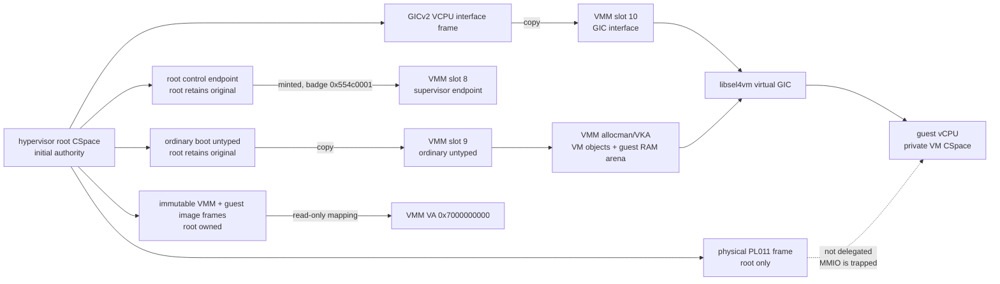
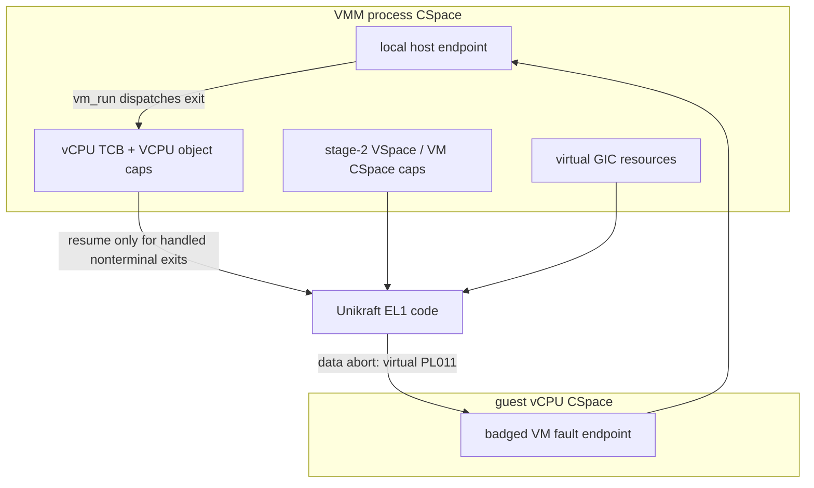

# Phase-2 capability model

This document owns the Phase-2 capability, CSpace, and authority model for the
single VMM. It describes the current implementation, not a general-purpose VM
manager. [Memory architecture](memory_architecture.md) owns the RAM layout;
the [boot sequence](boot.md) owns operation ordering.

## Design rules

- The root task retains every initial capability and all physical-device
  authority.
- The VMM receives the minimum construction authority needed for its one VM:
  one ordinary untyped plus the GICv2 VCPU-interface frame.
- A capability copy never transfers root's original authority. Root keeps the
  original untyped and the physical PL011 frame.
- The Unikraft guest has no direct seL4 CSpace access. Its PL011 accesses are
  stage-2 memory faults handled by the VMM, not device-frame capabilities.
- A badge identifies VMM-to-root lifecycle IPC. Root validates the badge,
  label, message length, payload, and lifecycle ordering before accepting an
  event.

## Authority flow

The dashed PL011 edge is deliberately absent capability delegation: it records
the device relationship without granting the guest or VMM a physical UART
frame capability.

## VMM process CSpace

`sel4utils` creates the VMM with a 16-bit CSpace. Slots 1--7 are process
bootstrap resources and are not part of the application-defined manifest.
The fixed manifest begins at `SEL4UTILS_FIRST_FREE` (slot 8).

| Slot | Capability | Source | Purpose | Authority boundary |
| --- | --- | --- | --- | --- |
| 1--7 | sel4utils process resources | Root process construction | CNode, fault endpoint, VSpace root, ASID pool, TCB, and architecture-dependent process objects | Not reusable by VMM allocation. |
| 8 | Badged supervisor endpoint | Mint of root endpoint | `READY` and guest lifecycle IPC to root | Badge must be `0x554c0001`; VMM cannot create root authority from it. |
| 9 | Ordinary untyped | Copy of root-selected boot untyped | VMM allocman/VKA construction budget | Root retains the original cap; no device untyped is provided. |
| 10 | GICv2 VCPU-interface frame | Copy of root-created frame at `0x08040000` | libsel4vm virtual GIC support | It is the sole delegated platform frame. |
| 11 onward | VMM-local allocations | Derived from slot 9 | Endpoints, CNodes, TCBs, VCPUs, page tables, and RAM-frame caps | Allocator starts only after fixed slots are reserved. |

The VMM reconstructs a deliberately narrow `simple_t`: one ordinary untyped,
the VMM's own CNode/VSpace/ASID/TCB resources, and only the fixed GIC frame.
Calls asking it for another initial capability or another frame return a null
cap or an error. This prevents libsel4vm setup from accidentally treating the
VMM as an initial task with broad platform authority.

## VM-internal capability boundary

libsel4vm constructs a separate VM CSpace for the guest vCPU. It contains the
fault endpoint path used to report guest exits to the VMM and the objects
needed to run that vCPU. The VMM retains the object capabilities it needs to
configure the guest TCB, VCPU object, stage-2 VSpace, virtual GIC, and local
host endpoint.

The guest cannot invoke the root control endpoint, derive objects from the
VMM's untyped, or map physical devices. The apparent PL011 device in its FDT
is virtual: access to `0x09000000..0x09000fff` reaches the VMM's supported
memory-fault callback. Only the required 16-bit register accesses are
emulated; all other accesses are terminal runtime failures.

## Lifecycle IPC and fault containment

The root endpoint serves two related roles: it is configured as the VMM
process fault endpoint and is minted into slot 8 for VMM lifecycle messages.
The badge and strict message shape distinguish accepted lifecycle events from
malformed IPC or faults.

| Event source | Required form | Root action |
| --- | --- | --- |
| VMM lifecycle message | Badge `0x554c0001`, label 0, one word, valid payload | Admit only the next legal lifecycle transition. |
| Malformed lifecycle message | Wrong badge, label, length, or payload | Terminal failure; no PASS. |
| VMM process fault | Arrives on the root-held endpoint but does not match the accepted event contract | Terminal failure; no PASS. |
| Guest VM exit | Delivered to VMM-local host endpoint | `vm_run()` dispatches supported PL011/SMC handling; unexpected exits fail. |

```mermaid
stateDiagram-v2
    [*] --> READY: VMM_READY
    READY --> LOADING: GUEST_LOADING
    LOADING --> BOOTING: GUEST_BOOTING
    BOOTING --> STARTED: exact UART hello
    STARTED --> STOPPED: PSCI SYSTEM_OFF
    STOPPED --> [*]: one PASS, root blocks

    READY --> FAILED: malformed IPC or fault
    LOADING --> FAILED: malformed IPC or fault
    BOOTING --> FAILED: malformed IPC, fault, or runtime error
    STARTED --> FAILED: invalid terminal event
    FAILED --> [*]: no PASS; root blocks
```

On accepted `SYSTEM_OFF`, the VMM suspends the vCPU before sending
`GUEST_STOPPED` and then blocks on its local endpoint. Root emits PASS only
after accepting that event and then blocks on its endpoint. These explicit
terminal waits keep neither task from returning into a non-existent runtime
caller and prevent capability use after terminalization.

## Deliberate non-authority

| Not delegated | Consequence |
| --- | --- |
| Physical PL011 frame and IRQ authority | UART is trapped and emulated; guest output cannot program host hardware. |
| Root initial CNode, bootinfo, and unrelated initial caps | VMM cannot discover or reuse root authority. |
| Device untypeds | VMM can construct anonymous RAM and VM objects only from the one ordinary untyped. |
| Additional CPUs, guest RAM arenas, virtio devices, or guest-management endpoints | The fixed Phase-2 model remains one vCPU, one guest, and no management API. |

Changing a slot, badge, delegated object type, or the narrow `simple_t`
facade changes this capability contract and requires coordinated root, VMM,
target-test, and memory-architecture updates.
