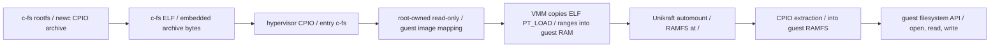

# Storage and filesystem architecture

This document owns Underlord's current storage and filesystem boundary. It
describes the implemented `c-fs` guest contract, its data path, and its
authority limits. Guest RAM and CSpace geometry remain owned by the
[memory architecture](memory_architecture.md) and
[capability model](capability_model.md); boot ordering remains owned by the
[boot sequence](boot.md).

## Current contract

Underlord currently has no persistent storage device, host-shared filesystem,
or storage backend. The supported `c-fs` guest contains a `newc` CPIO archive
inside its Unikraft ELF. At guest boot, Unikraft mounts guest-local RAMFS at
`/` and extracts the embedded archive into it. Filesystem reads and writes
then occur entirely in the guest's anonymous 128 MiB RAM bank.

The root filesystem is initialized anew on every guest boot. A write made by
the guest is not visible to the hypervisor or host and is lost when the guest
stops, faults, or is recreated. The embedded archive is immutable input: it
is rebuilt with the `c-fs` ELF, not changed at runtime.

The CPIO archive travels only as ELF bytes. It is not an initrd handed to the
VMM, a block image, or a separately mapped guest memory region.

## Capability and device boundary

| Resource | Owner | Guest-visible behavior |
| --- | --- | --- |
| Bundled `c-fs` ELF and embedded archive | Hypervisor root task | Root owns the image frames and maps them read-only into the VMM for loading. |
| Guest RAMFS contents | Unikraft guest | Created from the embedded archive in anonymous guest RAM; never exposed as host storage. |
| VMM construction untyped, slot 9 | VMM, derived from a root-retained ordinary untyped | Backs VM objects and anonymous guest RAM only; it is not a device or a storage capability. |
| GICv2 interface, slot 10 | VMM | Virtual interrupt-controller support only. |
| PL011 UART | Root-owned physical device, VMM-emulated GPA | Output-only console; it carries diagnostics and acceptance payloads, not filesystem I/O. |

The VMM receives no block-device frame, device untyped, IRQ, DMA authority,
virtio transport, host directory handle, or backend endpoint. The runtime FDT
contains RAM, GICv2, generic timer, PSCI, and the virtual PL011 only; it has
no storage-device node. Therefore a guest cannot discover or use a persistent
storage device under the present contract.

## Build and acceptance contract

`UNDERLORD_GUEST=c-fs` selects the externally built `c-fs` ELF and matching
Unikraft `.config`. Configuration admission requires the common AArch64
QEMU-virt platform contract plus VFSCore, automount, embedded-initrd
extraction, RAMFS, and UKCPIO.

The `c-fs` archive contains `/hello.txt` with the exact payload
`UNDERLORD_C_FS_FILE: PASS`. After the VMM captures that payload through the
trapped PL011, it emits `GUEST_STARTED`; the guest's PSCI `SYSTEM_OFF` then
allows the ordered terminal protocol to produce exactly one
`UNDERLORD_PHASE2_RESULT: PASS`. This proves that the selected guest read the
file extracted from its embedded archive. It does not prove persistence,
flush durability, host visibility, or a block-device interface.

## Future storage work

Persistent or host-shared storage is a separate architecture change. It must
define the backing-store owner and lifetime, the guest transport and FDT
contract, request validation, queue-memory authority, interrupt delivery,
flush semantics, VMM recreation behavior, and target acceptance that survives
a guest restart. It must not be implemented by widening the current VMM
untyped or device authority without updating the capability and memory
contracts.

The direct-QEMU persistent-storage test guest is specified separately in
[the storage test contract](../storage-test-contract.md). Its results are not
evidence for Underlord until the same contract is implemented and validated by
`build/simulate`.
